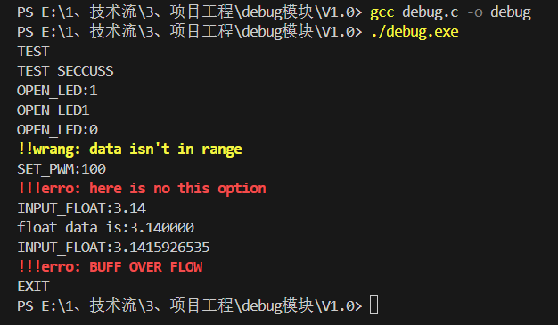

# Lite Debug Module

这是一个轻量化的嵌入式debug模块，支持 无参数命令 和 单参数命令。简单配置串口初始化和串口中断后即可使用。
This is a lightweight embedded debug module that supports parameter-free and single-parameter commands. Simply configure serial port initialization and serial port interruption and can be used.

## 使用流程
1. 在源文件中有4个用户配置的注释代码，按要求添加用户代码
 - 用户配置0（Debug.h）添加头文件
 - 用户配置1（Debug.c）添加串口初始化
 - 用户配置2（Debug.c）添加RX读取
 - 用户配置3（Debug.c）添加命令与处理代码
2. 源文件可在电脑模拟运行，嵌入单片机项目时，需删除模拟代码
  - [debug.c  行52] 
```c
  Uart_Buff[Uart_Rx_Num] = getchar(); // 电脑模拟串口输入
```
  - [debug.c  行150] 

  ```c
  /*电脑模拟运行*/
  int main(void)
  {
  	Debug_init();
  	while (1)
  	{
  		USART_Interrupt_Handler();
  		Debug_Handler();
  	}
  }
  ```

## PC示例运行
源文件不用更改可直接在电脑编译运行。




## 单片机示例运行

待更新...
